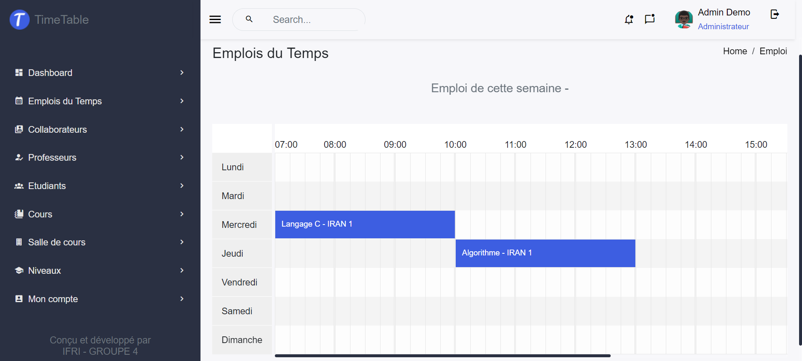

# GestionTime_FPBM | Projet fin module Python avancé - 2024-2025

## Description

Le projet d'intégration IFRI 2022 est un projet qui consiste à déployer une application capable de gérer la planification des emplois du temps.

## Preview

### - Authentification


### Dashboard (Admin)


### Dahboard (Etudiant)


### Dashboard (Professeur)


### Liste des emplois du temps (Admin)


### Visualisation d'un emplois du temps



## DEMO

Vous pouvez tester le démo de l'application sur la version en ligne avec ce compte administrateur : 

    - Email : admin@test.com
    - password : admin
## Comment installer Django

Ouvrez votre terminal et exécutez la commande suivante pour installer Django à l'aide de l'outil de gestion de packages pip :
```bash
pip install Django
```
Si vous utilisez une version spécifique de Python, utilisez plutôt la commande suivante pour installer Django :

```bash
python -m pip install Django
```	
Attendez que l'installation se termine. Une fois terminée, vous devriez avoir Django installé sur votre machine.

Pour vérifier si Django est installé correctement, exécutez la commande suivante dans votre terminal :

```bash
django-admin --version
```
Cela affichera la version de Django installée.

Maintenant que vous avez Django installé, vous pouvez continuer à travailler sur le projet d'intégration IFRI 2022.

## Comment lancer l'application sur votre machine

Pour récuperer et lancer l'application sur votre machine, assurez vous d'abord d'avoir python et django installé sur votre machine. Ensuite procéder aux étapes suivantes :

```bash
git clone https://github.com/v1p3r75/PIL1_2223_4.git

cd PIL1_2223_4

python manage.py migrate

python manage.py runserver 8000
```
L'application va démarrer sur l'addresse http://localhost:8000 : copier cet addresse et lancer-le dans le navigateur.

L'application est maintenant lancé !


## Comment travailler sur le projet

Pour travailler sur le projet, suivez les étapes ci-dessous :

Assurez-vous d'obtenir l'autorisation nécessaire pour travailler sur le projet.
    
- Clonez le référentiel sur votre machine si ce n'est pas déjà fait.
    
- Avant de commencer à travailler sur une nouvelle fonctionnalité, assurez-vous de créer une branche distincte pour celle-ci.

- Utilisez la commande suivante pour créer une nouvelle branche à partir de la branche principale (main)
    
```bash
    git checkout -b nom_de_votre_branche
```	
    
- Travaillez sur votre branche en effectuant les modifications nécessaires.
    
- Une fois que vous avez terminé les modifications, ajoutez les fichiers modifiés au suivi Git en utilisant la commande : git add .

- Validez vos modifications en créant un commit descriptif : 
```bash
git commit -m "Description du commit"
```	

- Poussez votre branche sur le référentiel distant en utilisant la commande :
```bash
git push origin nom_de_votre_branche
```

-  Une fois que vous êtes satisfait de vos modifications et que vous souhaitez les intégrer au projet principal, créez une demande de fusion (pull request) sur la plateforme de gestion des projets.

- Attendez la revue de code et les commentaires des autres membres de l'équipe.

- Effectuez les ajustements nécessaires en fonction des commentaires reçus et continuez à pousser vos modifications sur votre branche.

- Une fois que votre demande de fusion a été approuvée, votre branche peut être fusionnée avec la branche principale (main) du projet.

## L'erreur à éviter

Afin de maintenir un flux de travail efficace et de garantir la qualité du code, voici quelques erreurs à éviter lors de votre contribution au projet :

- Ne travaillez pas directement sur la branche principale (main) du projet.
    
- Utilisez des branches distinctes pour chaque fonctionnalité.
    
- N'oubliez pas de créer des commits cohérents et descriptifs pour chaque modification.
    
- N'oubliez pas de tester vos modifications avant de les pousser sur le référentiel distant.
    
- Ne fusionnez pas votre propre branche sans passer par une revue de code par d'autres membres de l'équipe.
    
- Prenez en compte les commentaires et les suggestions de l'équipe lors de la revue de code et apportez les ajustements nécessaires.
    
- En suivant ces bonnes pratiques, nous pourrons maintenir un flux de travail efficace et garantir la qualité du code produit.


## Aide

Vous vous sentez pas à l'aise avec les commandes ? Vous pouvez faire les choses avec l'interface graphique de l'éditeur VS Code.

## Plus d'aide 

Contactez les autres membres de l'équipe
